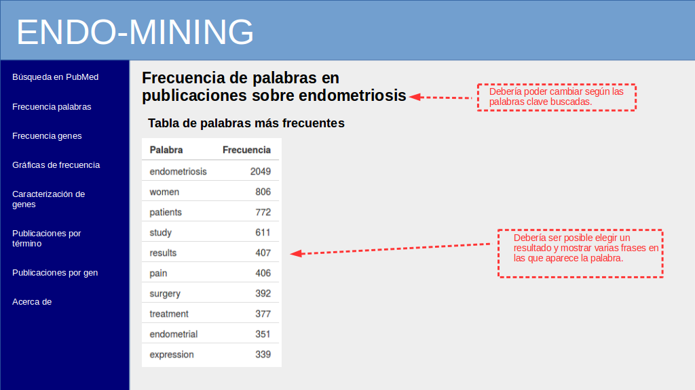
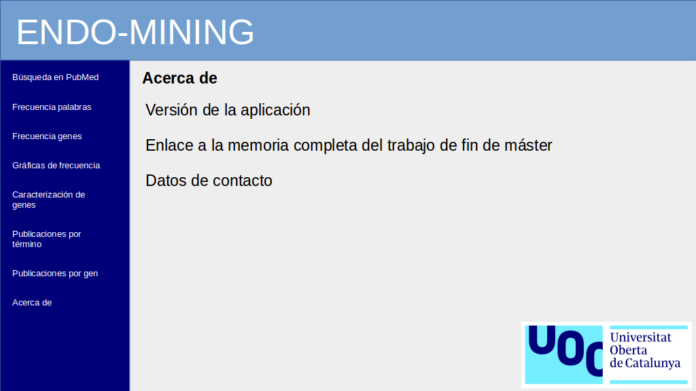

  
```{r setup, include=FALSE}
# knitr options

# Do not display code in output document
knitr::opts_chunk$set(echo = FALSE,
                      message = FALSE,
                      warning = FALSE,
                      fig.align = "center")
```

```{r libraries, include=FALSE}
# Load packages
library(knitr)
```
\newpage

# Descripción del avance del proyecto

## Grado de cumplimiento de los objetivos y resultados previstos en el plan de trabajo

Los objetivos planteados generales y específicos son:

### Objetivos generales

1. Encontrar genes relacionados con la endometriosis aplicando técnicas de minería de textos.

### Objetivos específicos

1. Desarrollar un script que permita realizar un procedimiento de minería de textos automáticamente, desde la recopilación de datos en bruto hasta la presentación de resultados.

2. Desarrollar una aplicación web implementando el script de minería de textos que resultó del objetivo anterior.


# Relación de las actividades realizadas

## Actividades previstas en el plan de trabajo

### Tarea 1. Definir esquema de la aplicación web

El objetivo de esta tarea era tener una idea clara de la estructura que tendría la aplicación una vez finalizada; los _inputs_ necesarios, los _outputs_, los diferentes controles y una idea aproximada del aspecto final. Lo que empezó como unos garabatos en una libreta terminó convirtiéndose en una serie de diapositivas diseñadas con LibreOffice Draw que incluyo a continuación:

```{r 0 pantalla inicial, fig.cap='Pantalla inicial. Incluye los campos para entrada de palabras clave de búsqueda y rango de fechas. Muestra la cantidad de citas encontradas y una tabla con los datos de publicación de todas ellas.'}

```

```{r 1 frecuencia palabras, fig.cap='Frecuencia de palabras. Muestra una tabla con la frecuencia de las palabras que componen el corpus primario.'}

```

```{r 2 frecuencia genes, fig.cap='Frecuencia de genes. Muestra una tabla con los genes recuperados del corpus primario y su frecuencia, ordenados de mayor a menor.'}
include_graphics("data/pantallas/img2.png")
```

```{r 3 graficas frecuencia, fig.cap='Gráficas de frecuencia de palabras y genes en el corpus primario. Listas desplegables permitirán elegir el tipo de gráfica (nube de palabras o gráfica de barras) y la entidad mostrada (palabras o genes). Se podrá elegir la frecuencia máxima y mínima de las entidades representadas, y cuántas entidades aparecerán en las gráficas.'}

```

```{r 4 ontologia, fig.cap='Caracterización por ontología génica. Muestra en una gráfica de barras los datos de ontología génica sobrerrepresentados en la muestra de genes. Con una lista desplegable se podrá elegir representar los datos correspondientes a procesos biológicos, componentes celulares o función molecular.'}

```

```{r 5 filtro termino, fig.cap='Filtrar publicaciones por término. El usuario podrá introducir una palabra y obtener como resultado un subgrupo del corpus conteniendo dicha palabra.'}

```

```{r 6 filtro gen, fig.cap='Filtrar publicaciones por gen. El usuario podrá elegir un gen de una lista desplegable, de entre la lista de genes extraidos del corpus primario. El resultado será una selección de las citas del corpus que contienen el gen seleccionado.'}

```

```{r 7 acerca de, fig.cap='Esta sección de la aplicación mostrará al usuario información acerca de la propia aplicación, el trabajo de fin de máster en el que tiene su origen y los datos de contacto del creador.'}

```

## Actividades no previstas y realizadas

# Relación de las desviaciones en la temporización y acciones de mitigación si procede y actualización del cronograma si procede 
 
## Desviaciones

## Acciones de mitigación

## Actualización del cronograma

# Listado de los resultados parciales obtenidos hasta el momento (entregables que se adjuntan)

# Apéndices
 
## Apéndice A: Código

El documento original en formato .Rmd que incluye el código completo en lenguaje R usado para generar este informe (fichero `PEC3_fase2_informe.Rmd`), se puede consultar y descargar en el siguiente repositorio de Github:
[jorgevallejo/endometriosis-text-mining](https://github.com/jorgevallejo/endometriosis-text-mining/tree/master/PEC2)

## Apéndice B: Reproducibilidad {#apendiceB}
```{r session_info, include=TRUE, echo=TRUE, results='markup'}
sessionInfo() # For better reproducibility
```

\newpage

# Referencias
\
