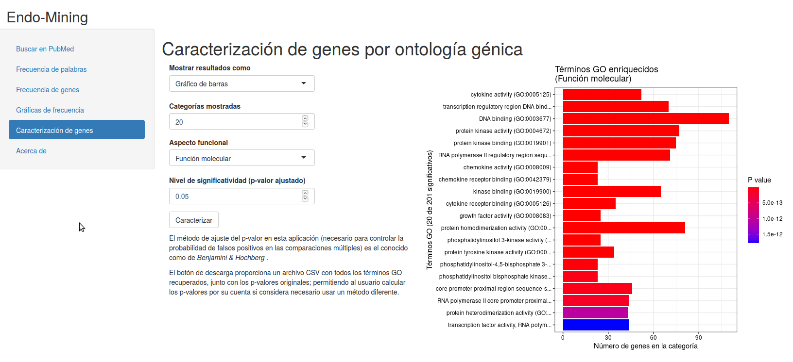

<<<<<<< HEAD

# Qué es este proyecto
>>>>>>> 25acfe3eed20f98b397bfce7a97df1a6a0db397b

**Endo-mining** es el resultado de mi trabajo de fin de máster para el Máster de Bioinformática y Bioestadística de la Universitat Oberta de Catalunya.

El trabajo perseguía tres objetivos:

1. Encontrar genes relacionados con la endometriosis aplicando técnicas de minería de textos.

2. Desarrollar un script que permita realizar un procedimiento de minería de textos automáticamente, desde la recopilación de datos en bruto hasta la presentación de resultados.

3. Desarrollar una aplicación web implementando el script de minería de textos resultante del objetivo anterior.

## Resultados del trabajo

Como resultado del trabajo han quedado cuatro productos:

1. [La memoria del trabajo de fin de máster](https://github.com/jorgevallejo/endometriosis-text-mining/blob/master/PEC4/vallejo_ortega_jorge_Memoria_PEC4_20210608.pdf). En ésta se explican cuáles son los antecedentes del proyecto, su justificación, los métodos seguidos y los resultados.

2. [Un vídeo](http://hdl.handle.net/10609/133006) en el que explico el proyecto y presento la aplicación web.

3. [El script](https://github.com/jorgevallejo/endometriosis-text-mining/blob/master/PEC2/PEC2_fase1_script.R). Script en lenguaje R que realiza el procedimiento de minería de textos y análisis de resultados automáticamente, sin interacción con el usuario.

4. [La aplicación web](https://endo-mining.shinyapps.io/shinyapp/). El resultado más interesante del proyecto ya que, al contrario que el script, es interactiva. Diseñada usando R Shiny ([enlace al código](https://github.com/jorgevallejo/endometriosis-text-mining/tree/master/PEC2/shinyapp)).

## Estructura del repositorio

Cada una de las carpetas corresponde a una entrega parcial del trabajo.

- **PEC0:** Propuesta del trabajo de fin de máster

- **PEC1:** Plan de trabajo.

- **PEC2:** Informe de seguimiento de mitad de proyecto.

    Incluye el código de la aplicación web en la carpeta `shinyapp`.

- **PEC3:** Informe de seguimiento de tres cuartos de proyecto.

    Incluye el archivo del script (`PEC3_fase2_script.R`).

- **PEC4:** Memoria del proyecto.

- **PEC5a:** Esquema y guión de la presentación en vídeo.

- **script/data:** Archivos de datos necesarios para el funcionamiento del script.